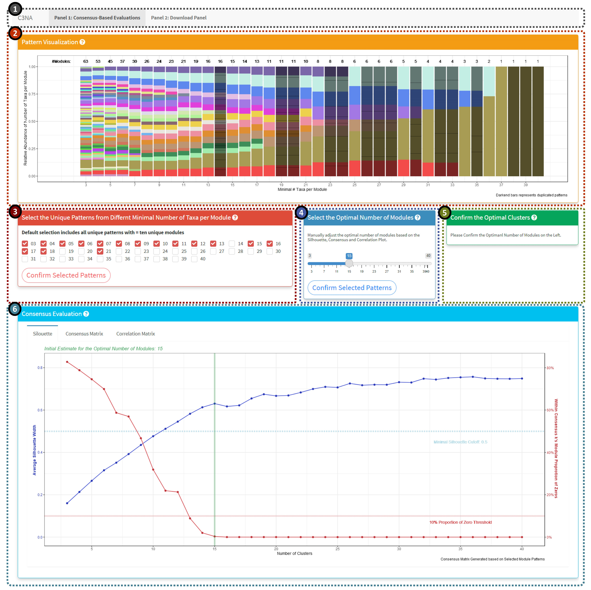
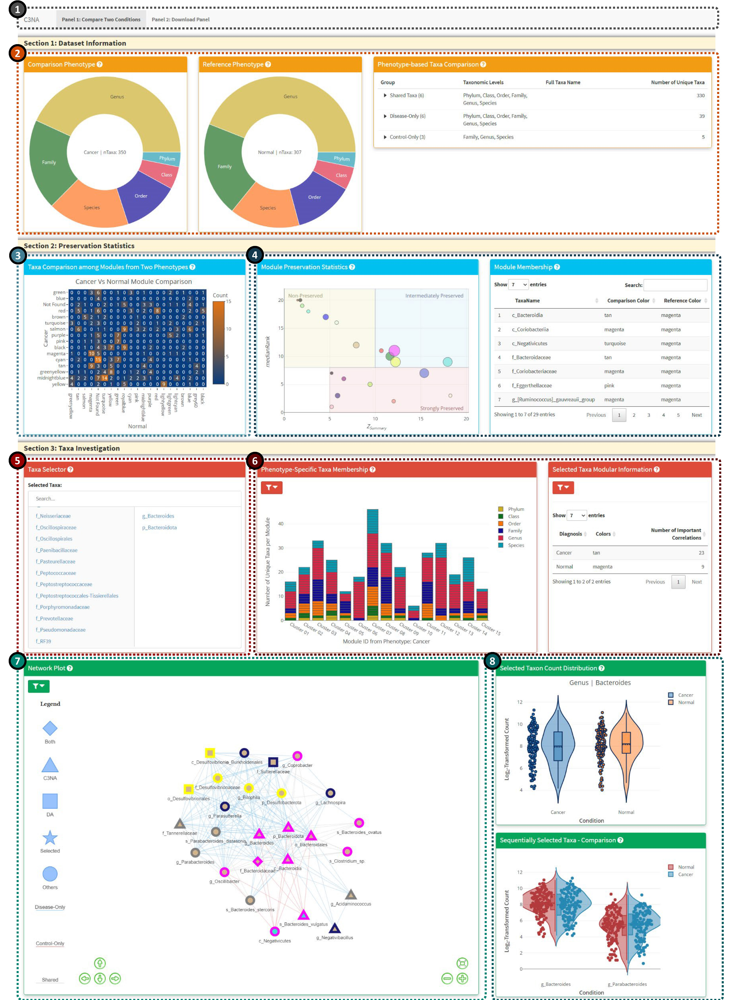

Correlation and Consensus-based Cross-taxonomy Network Analysis (C3NA) <a href='https://github.com/zhouLabNCSU/C3NA/'></a>
==

Table of Contents
---

1.  [Description](#Description)
2.  [Installation](#installation)
3.  [Workflow](#workflow)
4.  [Package Documents and Tutorials](#package-documents-and-tutorials)
5.  [Shiny Demonstration](#shiny-domenstration)

Description
-----------
C3NA is a open-source R package for co-occurence patterns investigation for compositional microbial sequencing data. C3NA used a consensus-based approach to cluster taxa from multiple taxonomic levels into modules and it can be used to conduct differential abundance network analysis between two phenotypes. <br>
Please check out the [Get started](https://zhoulabncsu.github.io/C3NA/articles/C3NA.html) to see the website for the C3NA packge. 

Installation
------------

```
# install.packages("devtools")
# devtools::install_github("zhouLabNCSU/C3NA")
# library(C3NA)
```
Please note due to many dependencies required for the C3NA, particularly the shiny elements to function properly, please visit the [Get started](https://zhoulabncsu.github.io/C3NA/articles/C3NA.html) to install the dependencies before install the C3NA package. 

Workflow
--------
  
  
Package Documents and Tutorials
-------------------------------
The package homepage contains tutorials and detailed guide for the C3NA pipeline. 
  - [Package Home Page](https://zhoulabncsu.github.io/C3NA/index.html)

Shiny Demonstration
-------------------
There are two interaction shiny applications: Module Evaluations and Compare Two Phenotypes

### Module Evaluations Shiny 
  
  <br>
The evaluation of the modules should follow the sequence: 2 >> 3 >> 4
  
-  1: Shiny panel navigation, including the 'Consensus-Based Evaluations' and 'Download Panel'. 
-  2: Unique patterns of the modules based on a range of minimal number of taxa per module. The darkened columns highlighted the duplicated patterns which are not included in the consensus-based evaluations.  
-  3: Manually select the pattern columns. Default will select all unique patterns with modules greater or equal to ten. 
-  4: Manually select the optimal number of modules based on the silhouette, consensus and correlation plots below. 
-  5: Generate the code the use should run after confirming the optimal selected patterns and optimal number of modules. 
-  6: Plot display panel including silhouette, consensus and correlation plots. 


### Compare Two Phenotypes Shiny 
  

-  1: Shiny panel navigation, including the 'Compare Two Conditions' and 'Download Panel'. 
-  2: Phenotype-based information from the two conditions, including shared and different taxa from various taxonomic levels. 
-  3: Module-based taxa comparison between the two phenotypes. 
-  4: Module preservation investigation, the left plot shows the Median Rank Vs. Z Summary with the node size reflect number of taxa in the respective module. The right plot is an interactive table from react to the click of the module preservation plot. 
-  5: Taxa selector for the interactive display in Panels 6-8. The user can select multiple taxa from the left columns (includes all significant taxa from both phenotypes), to remove the selected taxon, you can click the taxon from the right column
-  6: Bar plot for the taxa membership among the modules from either phenotypes. The user can switch between viewing all taxa or the selected taxa from the 'Taxa Selector'. For better display, the bar plot will only display the select taxon and its children taxonomic level taxa. Please click on the left filter icon to view plot-based options. 
-  7: Network plot based on the selected taxa. Mulitple options are available from the top left filter icon. 
-  8: Single and sequentially clicked taxa and their respective log2-transformed count from both phenotypes. 


