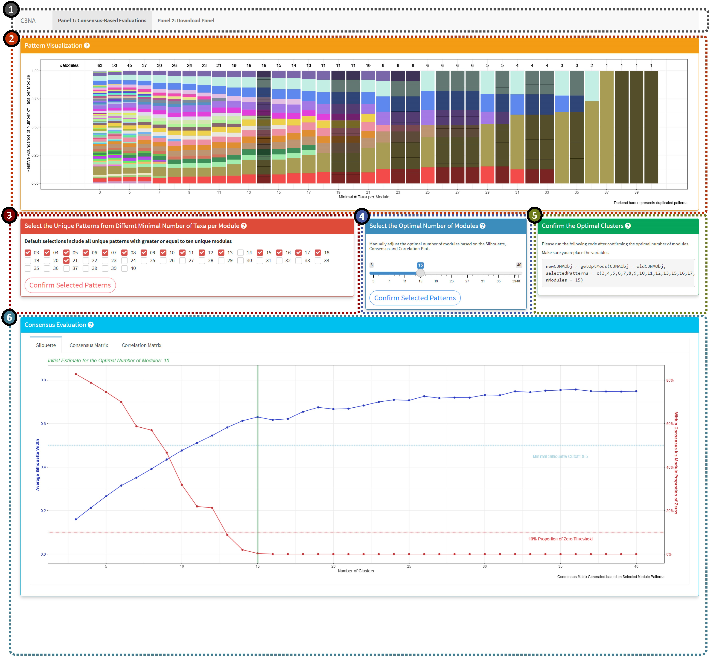

Correlation and Consensus-based Cross-taxonomy Network Analysis (C3NA) <a href='https://github.com/zhouLabNCSU/C3NA/'></a>
==

Table of Contents
---

1.  [Description](#Description)
2.  [Installation](#installation)
3.  [Workflow](#workflow)
4.  [Package Documents and Tutorials](#package-documents-and-tutorials)
5.  [Shiny Demonstration](#shiny-domenstration)

Description
-----------
C3NA is a open-source R package for co-occurence patterns investigation for compositional microbial sequencing data. C3NA used a consensus-based approach to cluster taxa from multiple taxonomic levels into modules and it can be used to conduct differential abundance network analysis between two phenotypes. <br>
Please check out the [Get started](https://zhoulabncsu.github.io/C3NA/articles/C3NA.html) to see the website for the C3NA packge. 

Installation
------------

```
# install.packages("devtools")
# devtools::install_github("zhouLabNCSU/C3NA")
# library(C3NA)
```
Please note due to many dependencies required for the C3NA, particularly the shiny elements to function properly, please visit the [Get started](https://zhoulabncsu.github.io/C3NA/articles/C3NA.html) to install the dependencies before install the C3NA package. 

Workflow
--------
  
  
Package Documents and Tutorials
-------------------------------
The package homepage contains tutorials and detailed guide for the C3NA pipeline. 
  - [Package Home Page](https://zhoulabncsu.github.io/C3NA/index.html)

Shiny Demonstration
-------------------
There are two interaction shiny applications: Module Evaluations and Compare Two Phenotypes

## Module Evaluations Shiny 
  
  <br>
-  DDD


## Compare Two Phenotypes Shiny 
  


