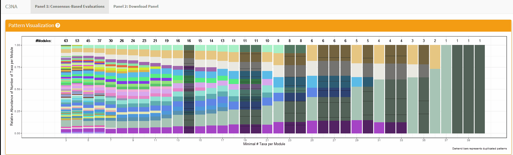

```{r, include = FALSE}
knitr::opts_chunk$set(
  collapse = TRUE,
  comment = "#>"
)
library(C3NA)
library(curl)
library(DT)
library(phyloseq)
```

**NOTE:** For better display of the taxa names and data parsing, we HIGHLY recommended the input tax_table() from the phyloseq object should not have any characters/symbols/spaces in front of the taxa names. For example, some reference database might have taxonomic level indicator in front of the taxa name, e.g. {g}__Bacteroides should be just Bacteroides under the Genus column. Please use gsub() or other text replacer to remove these characters. In addition, place make sure the column names for the taxonomic levels include Phylum, Class, Order, Family, Genus and Species. 

## General Note
For both Shiny applications, each sub-section has a question mark in the title which the user can click to get a description for the section:
```{r, echo = FALSE, out.width="900px"}

```

## Step 1. Load demo data
The demo file includes part of the 16S rRNA processed data from Baxter et al., with 127 Cancer and 134 Control subjects.
```{r}
# Loading the default 
data("CRC_Phyloseq")
CRC_Phyloseq = validatePhloseq(CRC_Phyloseq)
```

## Step 2. Initiate C3NA 
The goal of this step includes extracting a single phenotype object, then processing each of them individually with *initiateC3NA* with sparCC bootstrap, TOM similarity Matrix, and calculating module patterns information from a range of minimal numbers of taxa per module. 

```{r}
# Generate Cancer and Normal single phenotype phyloseq object
Cancer = phyloseq::subset_samples(physeq = CRC_Phyloseq, diagnosis == "Cancer")
Normal = phyloseq::subset_samples(physeq = CRC_Phyloseq, diagnosis == "Normal")
DT::datatable(as.matrix(phyloseq::tax_table(Normal)))
```
*This is an example of the taxonomic table we recommended for the correct use of C3NA*

The initiateC3NA() step involved with sparCC with bootstrap which is a computationally expensive procedure, especially for a recommended 1,000 iterations. The computation time can be as long as 6 days. For initial testing, please consider run at least 25 - 100 iterations which can be done under a few hours. Please check the Supplementary Results from our peper for more details on the stability of using lower number of iterations. 
```{r, eval = FALSE}
library(phyloseq) 
## This package loading is essential for avoiding a missing function error for taxa_are_rows
## Which is a deprecated function that cannot be loaded internally. 
Cancer_C3NA = initiateC3NA(phyloseqObj = Cancer, prevTrh = 0.1,
                           nCPUs = 12, nBootstrap = 1000,
                           nMinTotalCount = 1000, phenotype = "Normal",
                           minModuleSize = 3, maxModuleSize = 40,
                           seed = 100)
Normal_C3NA = initiateC3NA(phyloseqObj = Normal, prevTrh = 0.1,
                           nCPUs = 12, nBootstrap = 1000,
                           nMinTotalCount = 1000, phenotype = "Normal",
                           minModuleSize = 3, maxModuleSize = 40,
                           seed = 100)
```

### Step 2.1 Load the initiateC3NA results with 1000 iterations
```{r}
githubURL <- ("https://github.com/zhouLabNCSU/C3NA_ScriptsAndData/raw/main/RPackageTutorialData/Post-initiateC3NA/cancer_dada2_Cancer.rds")
Cancer_C3NA  <- readRDS(url(githubURL, method="libcurl"))
githubURL <- ("https://github.com/zhouLabNCSU/C3NA_ScriptsAndData/raw/main/RPackageTutorialData/Post-initiateC3NA/cancer_dada2_Normal.rds")
Normal_C3NA  <- readRDS(url(githubURL, method="libcurl"))
```

## Step 3. Module Evalutaion Shiny 
The shiny application will run on your default browser, e.g. Chrome, Firefox, etc.
```{r, eval = FALSE}
# Shiny Evaluation
moduleEvals(C3NAObj = Cancer_C3NA)
moduleEvals(C3NAObj = Normal_C3NA)
```

#### Step 3.1 Run the Provided Script
Please replace the 'oldC3NAObj' and 'newC3NAObj' with the correct and preferred name for your study.
```{r}
# Copy & Paste Generated Commands
Cancer_C3NA = getOptMods(C3NAObj = Cancer_C3NA,
                         selectedPatterns = c(3,4,5,6,7,8,9,10,11,12,13,15,16,17,18,21),
                         nModules = 15)
Normal_C3NA = getOptMods(C3NAObj = Normal_C3NA,
                         selectedPatterns = c(3,4,5,6,7,8,9,10,11,12,13,14),
                         nModules = 20)
```

## Step 4. Compare two phenotypes
This steps will include the module preservation analysis. 
```{r, message=FALSE, error=FALSE, results="hide"}
CancerVsNormal_C3NA = comparePhenotypes(C3NAObj_Comparison =Cancer_C3NA, 
                                        C3NAObj_Reference = Normal_C3NA,
                                        corCutoff = 0.2, fdr = 0.05, unusefulTaxa = NA, 
                                        nBootstrap = 300, verbose = FALSE)
## Remove the rdaata generated from permutation
unlink("./permutedStats-actualModules.RData",recursive=TRUE)
```

## Step 5. Adding the C3NA Influential Taxa 
```{r, results='hide'}
CancerVsNormal_C3NA = getInfluentialTaxa(CancerVsNormal_C3NA)
```

## Step 6. Adding Differential Abundance Resutls
Please Visit the Differenital Abundance Guide under **Articles** for full tutorials on how to conduct DA analysis and transfer results to C3NA results. 
```{r}
## Extract the Pre-calculated DA Analysis
githubURL <- ("https://github.com/zhouLabNCSU/C3NA_ScriptsAndData/raw/main/RPackageTutorialData/Post-initiateC3NA/DA_CancerVsNormal_DADA2_Results.rds")
CancerVsNormal_DA  <- readRDS(url(githubURL, 
                                  method="libcurl"))
## Adding the DA method to the two phenotypes comparison C3NA
CancerVsNormal_C3NA = addDAResults(twoPhenoC3NAObj = CancerVsNormal_C3NA, 
                                   DAResults = CancerVsNormal_DA)
```

## Step 7. Shiny Investigation of the Results
```{r, eval = FALSE}
compareTwoPhenoShiny(CancerVsNormal_C3NA)
```

## Step 8. Extract Summarized Results
```{r}
output = extractResults(CancerVsNormal_C3NA)
```

#### 8.1 Preivew the results - Taxa Taxa Correlations (Edges)
```{r}
DT::datatable(output[["taxaTaxaCorrelations"]][1:100,])
```

#### 8.2 Preivew the results - Taxa (Nodes)
```{r}
DT::datatable(output[["taxaTable"]][1:50,])
```


## Session Info
```{r}
print(sessionInfo())
```
