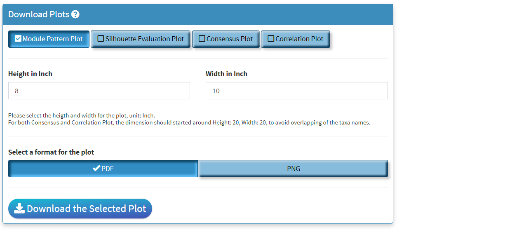

```{r, include = FALSE}
knitr::opts_chunk$set(
  collapse = TRUE,
  comment = "#>"
)
```

## Summary
The **Module Evaluation** is designed for validating the consensus-based approach with interactive selection of the module patterns as well as the optimal number of modules for the taxa. 

## Section 1: Module Patterns
```{r, echo = FALSE, out.width="900px"}
knitr::include_graphics("../man/figures/modEval_patterns.png")
```

+ The 'Pattern Visualization' section hosts the patterns in turns of the unique module due to the different minimal numbers of taxa per module.
+ The <b>x-axis</b> represents the different range of a minimal number of taxa per module; by default, it investigated between 3 and 40, and this range should be sufficient for observing all the necessary patterns. 
+ The <b>y-axis</b> represents The relative abundance of taxa per module.The colors are assigned using 'randomcolorR' package with a seed, which can be adjusted by setting the 'colorSeed' arguments when calling this Shiny application. 
+ The number of unique modules is displayed on top of the bar plot. 
+ Our investigation shown that the optimal patterns fro selection should be around the number of unique patterns drop to *10*. 

## Section 2: User Selector
```{r, echo = FALSE, out.width="900px"}
knitr::include_graphics("../man/figures/modEval_Selectors.gif")
```

+ **Left Panel**: The checkboxes panel is designed to allow the user to select more patterns if needed. Our investigated shown the optimal number of modules are aroudn the number of unique patterns of *10*. 
+ **Middle Panel**: The middle panel allow the user to select the optimal number of clusters based on the silhouette, consensus and correlation plots below. Our investigation shown the optimal number of modules should be the lowest possible number at the turning points in which the silhouette curve stop its sharp increase and shifted to a gradual increase pattern. The within intra-modular zeros is also used as indication of "goodness" of the consensus-based module, ideally this should be kept below 10%.  **IMPORTANT NOTE**: C3NA detects the first drop of the silhouette width after the intra-modular consensus dropped below 10%, this might be adjusted by the user on a case-by-case basis.
+ **Right Panel**: This is the code generator panel in which summarized the user's selected patterns and optimal number of modules. The user should copy and paste this from the shiny to their console and replace the new/old C3NAobj with the correct names. 

## Section 3: Diagnosis Plots
```{r, echo = FALSE, out.width="900px"}
knitr::include_graphics("../man/figures/modEval_SilCon2.gif")
```

+ **Silhouette Plot**: is based on clustering using the consensus matrix. Generally, the shape of the curve should a pattern of quick incrementation with the increased number of clusters followed by a plateau region where the incrementation rate is much slower. The optimal number of clusters should be around the turning point between these two clusters with a lower than 10% proportion of intra-modular zeros, which is shown in the intra-modular proportion of zero curve.
+ **Consensus Plot**: includes the consensus heatmap with the taxa name, taxonomic levels, and clusters shown. 
+ **Correlation Plot**: includes the correlation heatmap with the taxa name, taxonomic levels, and clusters shown.

## Section 4: Download Panel
```{r, echo = FALSE, out.width="900px"}

```

+ Four plots can be created in **Module Evaluations** shiny. All of them can be saved here.
+ Only the lastest rendered plot will be avaliable for download. The download should directly go to your *default browser download path*. 
+ When the number of clusters gets high, e.g. > *25*. The in-shiny render of the plot might not include the complete legend. In this case, please download the consensus/correlation plots and make sure you assign a larger width value. 
+ The dpi for images are *300*. 


