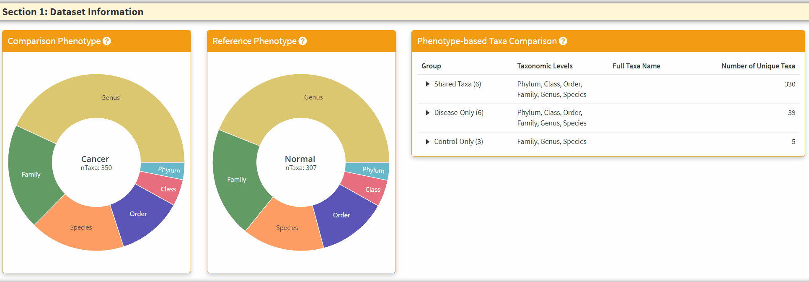
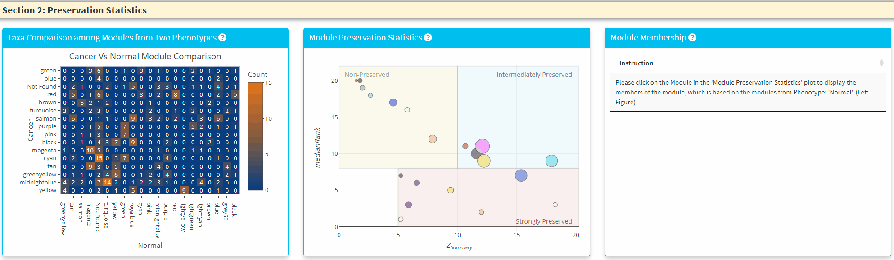
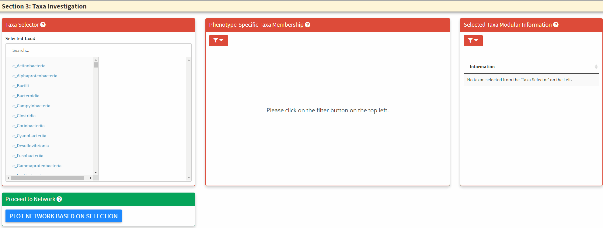
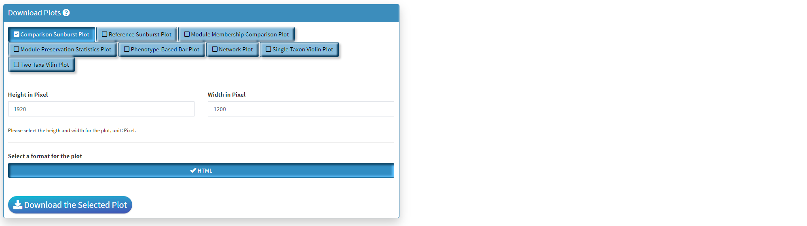

```{r, include = FALSE}
knitr::opts_chunk$set(
  collapse = TRUE,
  comment = "#>"
)
```

## Notes on Shiny Display
*You are highly recommended to view Shiny application under full window condition. The widgets, in terms of their respective width and height is designed and tested on 1080P full windows with 100% zoom (in Chrome). If you experience plot or table over-fitting the box surround them, please consider adjust the zoom for optimal viewing experience. This does not affect the functionality of the shiny.*

## Section 1: Dataset Information
```{r, echo = FALSE, out.width="900px"}

```

+ The **Two Left Panels** are the breakdown of the taxonomic information from two phenotypes. You can hover the respective section to obtain the total number of taxa in the category.
+ The **Right Panel** is an interactive panel that display the shared and unique taxa information from the two phenotypes. Please note these are **filtered taxa** and rare taxa are not displayed. 


## Section 2: Preservation Statistics
```{r, echo = FALSE, out.width="900px"}

```

+ The **Left Panel** displays the shared taxa between the modules from two phenotypes. If it is an unque taxon only found in one phenotype, it will be labelled uner *Not Found'
+ The **Middle Panel** displays the module preservation statistics with *medianRank* on the **y-axis** and *Z Summary* on the **x axis**. The module size reflects the number of taxa in the module. *Please Note the module shown here used the ***Reference** *dataset so this plot only contains the module found in reference*. You can click on the plot to show the taxa in the module on the *Right Panel*. *For modules that are very close to each other, the click finds the newest module center point*. 

## Section 3: Network Plots
```{r, echo = FALSE, out.width="900px"}

```

+ The **Left Panel** is the taxa selector panel. It allows multiple selection of the taxa from the left column. You can single click the right column taxon to remove it from selection. 
+ The **Middle Panel** is the bar plot to highlight taxa and its respective module membership. The hover information will display the selected taxon and all its higher taxonomic level information. You can use this to guide the C3NA investigation as this is the **ONLY** interactive plot displaying complete taxonomic information. You can choose between the selected taxa and all taxa for the color. When as single taxon is selected, only the select taxon and its children taxonomic level taxa will be highlighted. You can also switch between the phenotypes. 
+ The **Right Panel** allows the display of modular information of the selected taxa, it highlights how many significant taxa-taxa correlations the selected taxon has in both phentoypes. 

```{r, echo = FALSE, out.width="900px"}
knitr::include_graphics("../man/figures/twoPheno_Section3Par2.gif")
```

+ The **Network Plot** allows interactive evaluation of the netwrok structure that are shared or differs between the disease and control. There are many filtering parameter the user can use to refine the network. 
+ The **Top Right Plot** is enabled after a single click of the taxon/node on the **network plot**, which displays the log2 transformed count of the clicked taxon between the two phenotypes. Hover information is enabled for better understanding of the datapoint. 
* The **Bottom Right Plot** is enabled after two consecutive click of the taxa/nodes on the **network plot**, which displays the log2 transformed count of the two taxa between the two phenotypes. Hover information is enabled for better understanding of the datapoint. 

## Download Panel
```{r, echo = FALSE, out.width="900px"}

```

+ Four plots can be created in **Compare Two Phenotypes** shiny. All of them can be saved here.
+ Only the lastest rendered plot will be available for download. The download should directly go to your *default browser download path*. 
+ The downloaded HTML can be view using browser and all interactive functionality will be saved. There will not be filtering functions with these downloads, and please make sure the parameters are set before download. 


