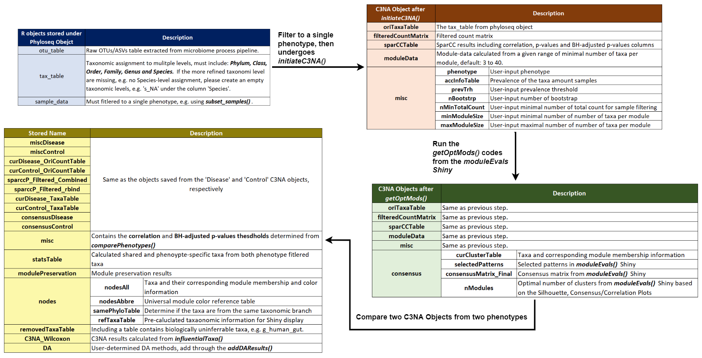

```{r, include = FALSE}
knitr::opts_chunk$set(
  collapse = TRUE,
  comment = "#>"
)
```

```{r, echo = FALSE, out.width="1800px"}

```

*You can right-click on the image to select 'open image on new tab' to view full resolution of the image*
